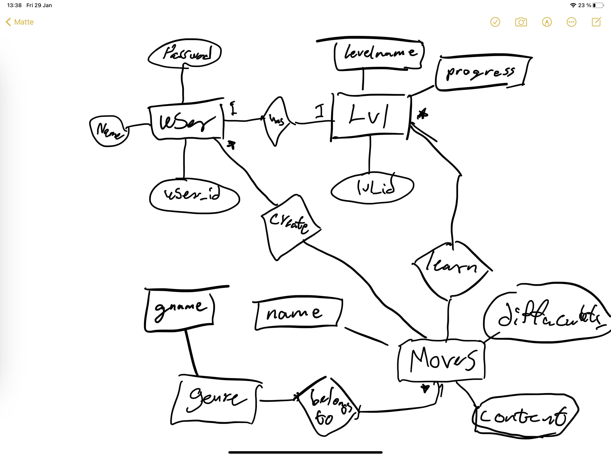

# Projektplan

## 1. Projektbeskrivning (Beskriv vad sidan ska kunna göra).
Jag vill bygga en applikation kallad Parkour Journey. Applikationen bygger på att man ska kunna lära sig olika parkour moves, bygga upp nya moves och osv. Det ska även finnas en achivments/levels del så att du liksom bröjar med att vara en noob och sen så går det upp. Jag lägger även upp en vän del där man kan se vart ens vänner ligger. 
## 2. Vyer (visa bildskisser på dina sidor).
Här är sidorna som jag tänkt ut just nu 02/05-21 jag la även till en till många relation som egentligen ska vara med i er diagrammet. 

## 3. Databas med ER-diagram (Bild på ER-diagram).
gammal diagram

nytt diagram

## 4. Arkitektur (Beskriv filer och mappar - vad gör/innehåller de?).
Mappar har vi först yardoc. Där innehåller de olika html sidor som bildar en wiki för hela det här projektet där man kan läsa om olika funktioner och routerna osv. Därefter har vi en misc map. Här ligger alla bilder som sidan använder sig av för att förklara olika tricks/moves.Vi har en db mapp som bara håller vår databas som vi använder oss av i denna applikation. Därefter har vi model och model ligger bara min model fil. Denna filen har bara en mängd av olika funktioner och fungerar som denna applikations biblotek av kommandon ungefär. Sen är de public mappen och det är den offentliga mappen denna syns för användarna. I där finns även css mappen med en css fil med all min css kod. Denna filen ändrar utseendet på min applikation. I public har vi även en uplodads map. Här är alla bilder som applikationen har laddat ner på grund av dess användare. Därefter har vi views mappen med alla våra slim filer. Dessa bestämmer html koden alltså vad som ska vara på sidorna som bildas av applikationen. Views har även en user map för att kunna vara enligt med restfoul routes. Därefter har vi massa er diagram och liknande för projektet som bara ligger i den stora mappen. Till sist har vi App.rb som startar applikationen  och har alla våra routes. App.rb kan man säga bestämmer hur allt ska vara och vad som ska komma näst. När man startar app.rb kommer man in på home pagen eller landing pagen. Därefter kan man navigera sig till antingen sing in eller sign up. Man kan alltså registrera sig eller logga in. Ifall du har ett konto och loggar in kommer du in på din egen sida där du kan se alla parkour moves du håller på att lära dig eller lär dig just nu. Du kan läsa vad dessa tricks är och hur du kan lära dig dem. När du lärt dig tillräckligt med många tricks kan du gå upp i lvl. I mitt program finns de 5 nivårer. nobb till legend. Det finns även lite andra filer men dessa finns bara för github som gör att projektet kan sparas online och tillkallas på vilken dator som möjligt. 

